---
## Front matter
title: "Отчёт по лабораторной работе № 3"
subtitle: "Архитектура компьютера"
author: "Старцева Алина "

## Generic otions
lang: ru-RU
toc-title: "Содержание"

## Bibliography
bibliography: bib/cite.bib
csl: pandoc/csl/gost-r-7-0-5-2008-numeric.csl

## Pdf output format
toc: true # Table of contents
toc-depth: 2
lof: true # List of figures
fontsize: 12pt
linestretch: 1.5
papersize: a4
documentclass: scrreprt
## I18n polyglossia
polyglossia-lang:
  name: russian
  options:
	- spelling=modern
	- babelshorthands=true
polyglossia-otherlangs:
  name: english
## I18n babel
babel-lang: russian
babel-otherlangs: english
## Fonts
mainfont: PT Serif
romanfont: PT Serif
sansfont: PT Sans
monofont: PT Mono
mainfontoptions: Ligatures=TeX
romanfontoptions: Ligatures=TeX
sansfontoptions: Ligatures=TeX,Scale=MatchLowercase
monofontoptions: Scale=MatchLowercase,Scale=0.9
## Biblatex
biblatex: true
biblio-style: "gost-numeric"
biblatexoptions:
  - parentracker=true
  - backend=biber
  - hyperref=auto
  - language=auto
  - autolang=other*
  - citestyle=gost-numeric
## Pandoc-crossref LaTeX customization
figureTitle: "Рис."
tableTitle: "Таблица"
listingTitle: "Листинг"
lofTitle: "Список иллюстраций"
lolTitle: "Листинги"
## Misc options
indent: true
header-includes:
  - \usepackage{indentfirst}
  - \usepackage{float} # keep figures where there are in the text
  - \floatplacement{figure}{H} # keep figures where there are in the text
---

# Цель работы

Целью работы является изучить идеологию и применение средств 
контроля версий. Приобрести практические навыки по работе с системой git.

# Задание

1. Настроить github
2. Выполнить базовую настройку git
3. Создать SSH ключа
4. Создать рабочее пространство на основе шаблона
5. Создать репозиторий курса на основе шаблона
6. Настроить каталог курса
7. Выполнить задание для самостоятельной работы

# Выполнение лабораторной работы

## Настройка github

Создали учётную запись на сайте https://github.com/ и заполнили 
основные данные. (рис. [-@fig:001]), (рис. [-@fig:002]), (рис. [-@fig:003]),
(рис. [-@fig:004]), (рис. [-@fig:005]), (рис. [-@fig:006])

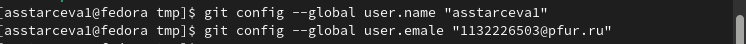{ #fig:001 width=70% }

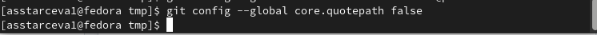{ #fig:002 width=70% }

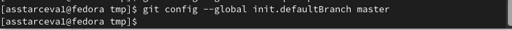{ #fig:003 width=70% }

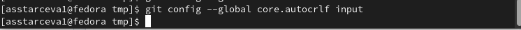{ #fig:004 width=70% }

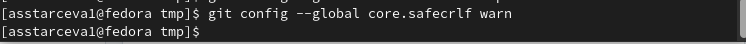{ #fig:005 width=70% }

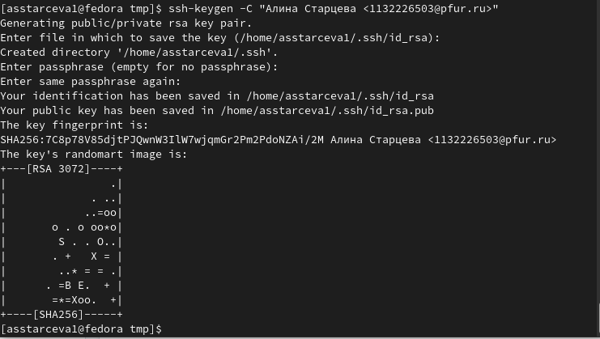{ #fig:006 width=70% }

## Базовая настройка git

Сначала сделали предварительную конфигурацию git. Открыли 
терминал и ввели следующие команды, указав имя и email владельца 
репозитория. (рис. [-@fig:007])

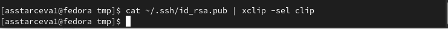{ #fig:007 width=70% }

Настроили utf-8 в выводе сообщений git. (рис. [-@fig:008])

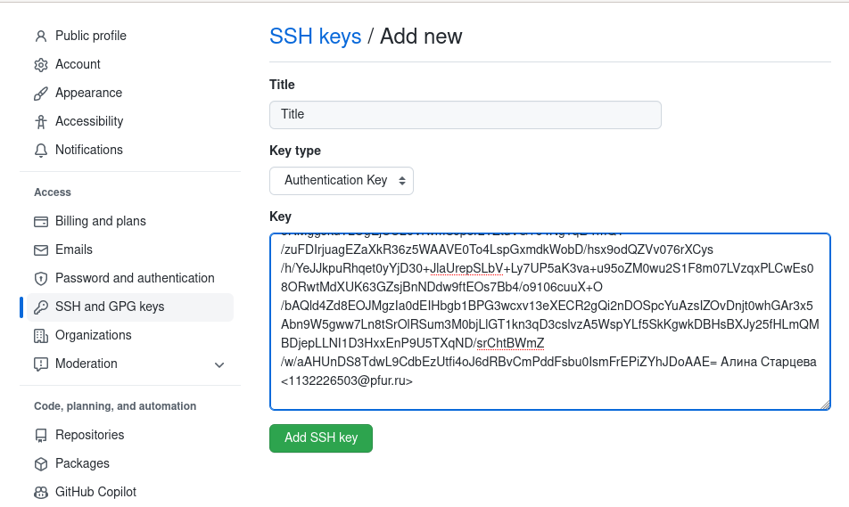{ #fig:008 width=70% }

Задали имя начальной ветки (назвали её master). (рис. [-@fig:009])

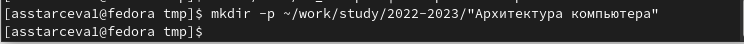{ #fig:009 width=70% }

Параметр autocrlf. (рис. [-@fig:010])

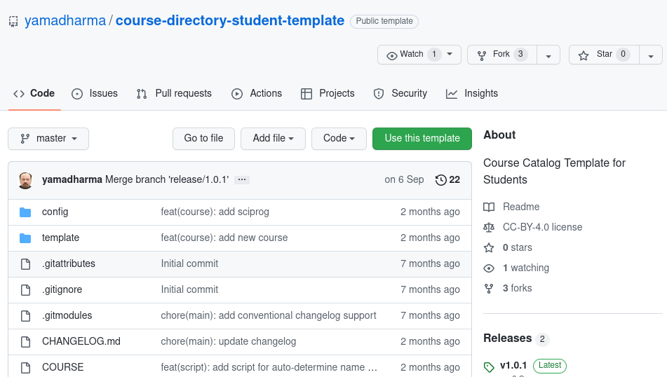{ #fig:010 width=70% }

Параметр safecrlf. (рис. [-@fig:011])

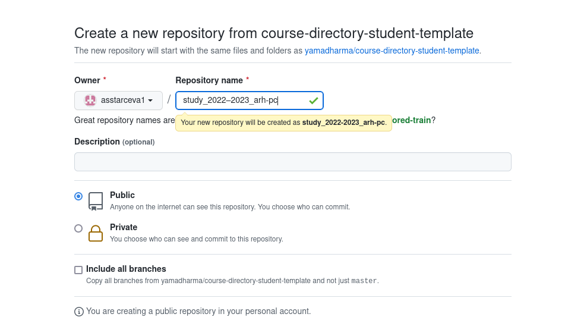{ #fig:011 width=70% }

## Создание SSH ключа

Для последующей идентификации пользователя на сервере 
репозиториев сгенерировали пару ключей (приватный и открытый). (рис. [-@fig:012])

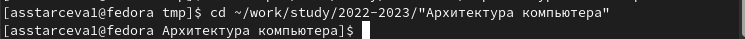{ #fig:012 width=70% }

Для загрузки сгенерённого открытого ключа зашли на сайт 
http://github.org/ под своей учётной записью и перешли в меню Setting . После 
этого выбрали в боковом меню SSH and GPG keys и нажали кнопку New SSH 
key . Скопировав из локальной консоли ключ в буфер обмена, вставили его в 
появившееся на сайте поле и указали для ключа имя (Title). (рис. [-@fig:013]),
(рис. [-@fig:014]), (рис. [-@fig:015])

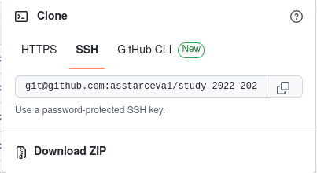{ #fig:013 width=70% }

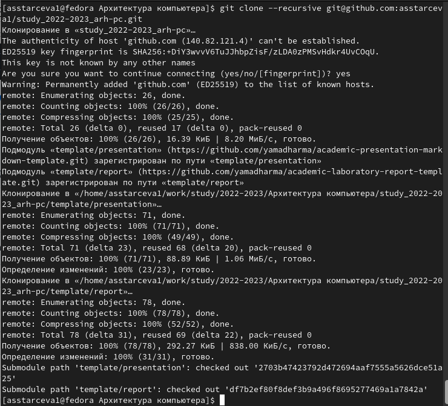{ #fig:014 width=70% }

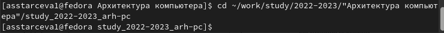{ #fig:015 width=70% }

##  Сознание рабочего пространства и репозитория курса на основе шаблона

Открыли терминал и создали каталог для предмета «Архитектура 
компьютера». (рис. [-@fig:016])

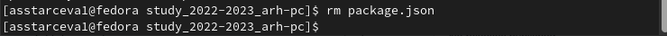{ #fig:016 width=70% }

## Сознание репозитория курса на основе шаблона

Перешли на станицу репозитория с шаблоном курса, 
https://github.com/yam adharma/course-directory-student-template, и выбрали 
Use this template. (рис. [-@fig:017])

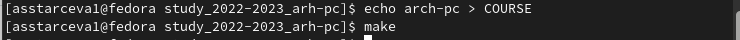{ #fig:017 width=70% }

В открывшемся окне задали имя репозитория (Repository name) 
study_2022–2023_arh-pc и создали репозиторий (кнопка Create repository from 
template). (рис. [-@fig:018])

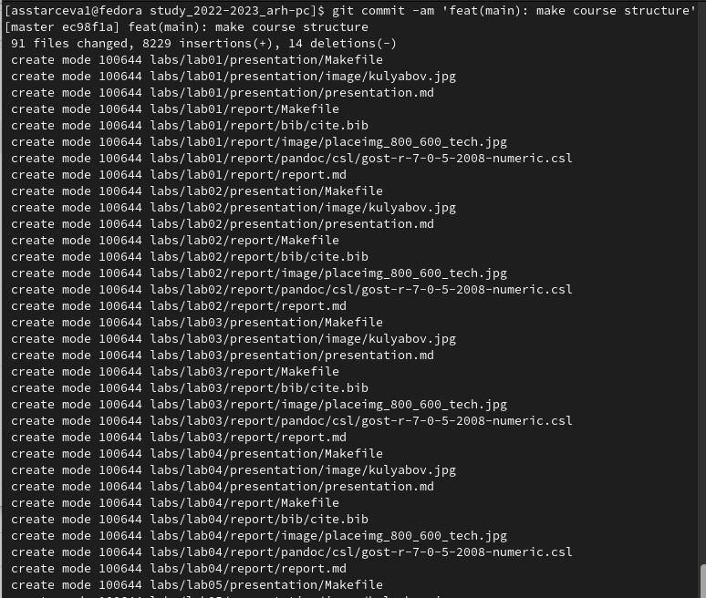{ #fig:018 width=70% }

Открыли терминал и перешли в каталог курса. (рис. [-@fig:019])

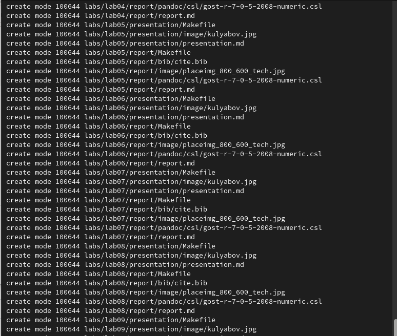{ #fig:019 width=70% }

Клонировали созданный репозиторий. Ссылку для клонирования 
скопировали на странице созданного репозитория Code -> SSH. (рис. [-@fig:020]), 
рис. [-@fig:021])

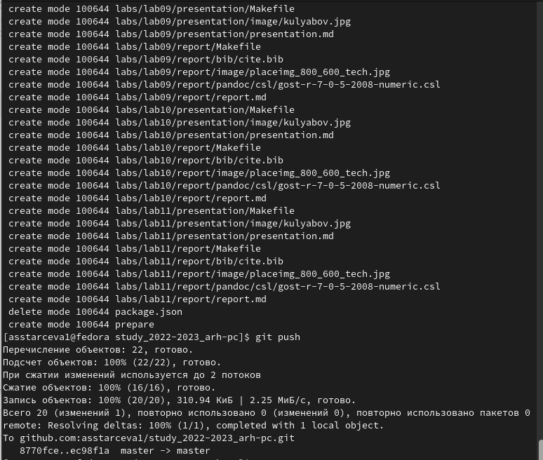{ #fig:020 width=70% }

{ #fig:021 width=70% }

## Настройка каталога курса

Перешли в каталог курса. (рис. [-@fig:022]) Удалили лишние файлы. (рис. [-@fig:023])
Создали необходимые каталоги. (рис. [-@fig:024]) Отправили файлы на сервер 
(рис. [-@fig:025]), (рис. [-@fig:026]), (рис. [-@fig:027]) Проверили правильность
создания иерархии рабочего пространства в локальном репозитории и на странице
github. (рис. [-@fig:028]), (рис. [-@fig:029])

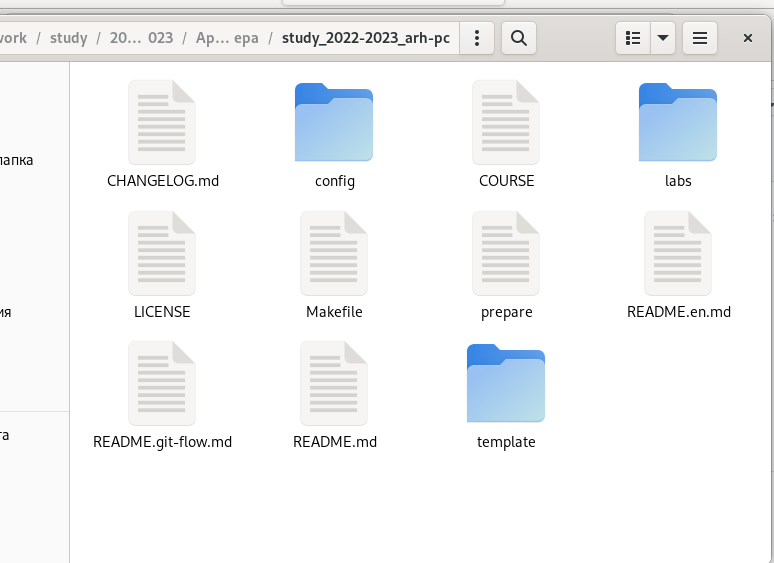{ #fig:022 width=70% }

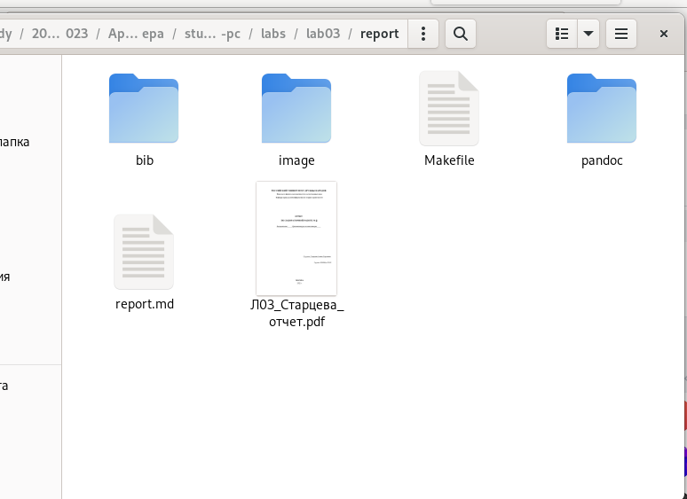{ #fig:023 width=70% }

{ #fig:024 width=70% }

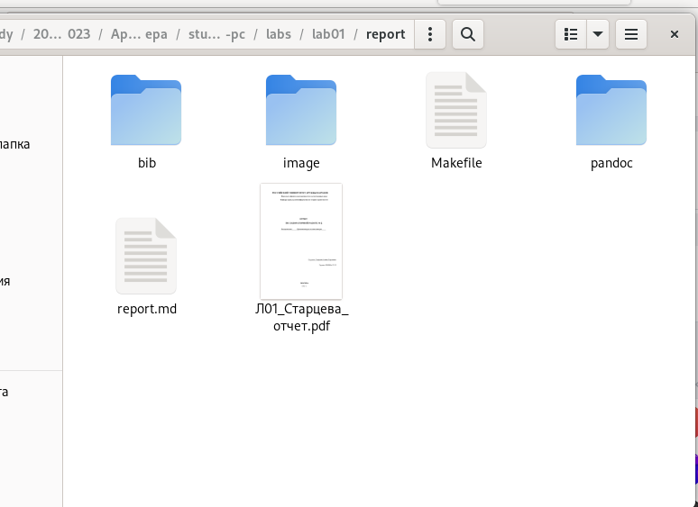{ #fig:025 width=70% }

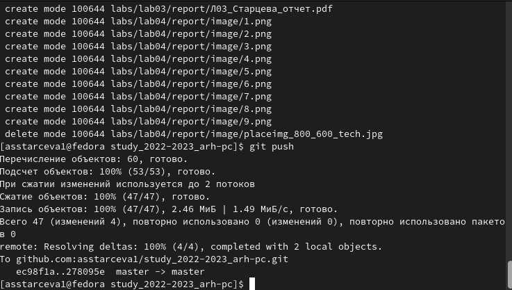{ #fig:026 width=70% }

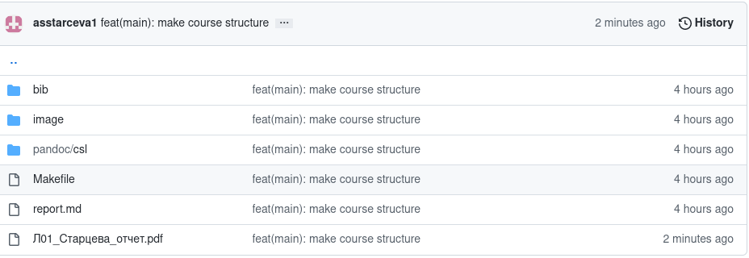{ #fig:027 width=70% }

{ #fig:028 width=70% }

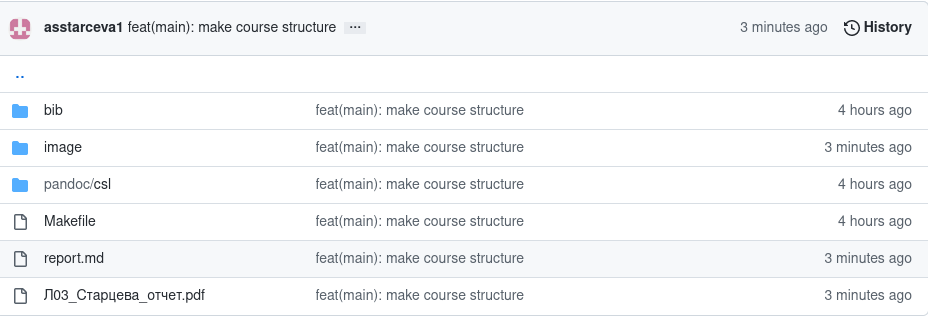{ #fig:029 width=70% }

## Задание для самостоятельной работы

1. Создали отчет по выполнению лабораторной работы в 
соответствующем каталоге рабочего пространства (labs>lab03>report). (рис. [-@fig:030])

{ #fig:030 width=70% }

2. Скопировали отчеты по выполнению предыдущих лабораторных работ 
в соответствующие каталоги созданного рабочего пространства. (рис. [-@fig:031]),
(рис. [-@fig:032])

{ #fig:031 width=70% }

{ #fig:032 width=70% }

3. Загрузили файлы на github. (рис. [-@fig:033]), (рис. [-@fig:034]),
(рис. [-@fig:035]), (рис. [-@fig:036])

{ #fig:033 width=70% }

{ #fig:034 width=70% }

{ #fig:035 width=70% }

{ #fig:036 width=70% }

# Выводы
В ходе работы были изучены идеология и применение средств 
контроля версий. Были приобретены практические навыки по работе с 
системой git. 

