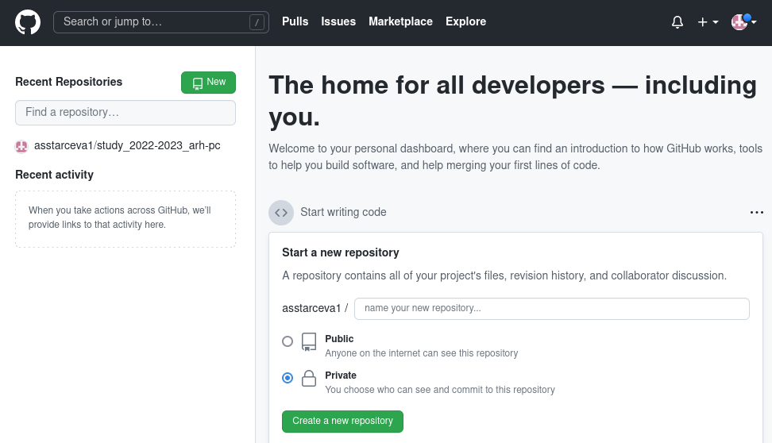
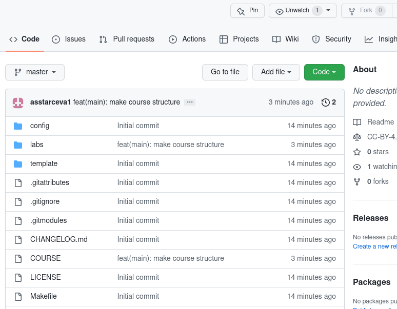

---
## Front matter
title: "Отчёт по лабораторной работе № 3"
subtitle: "Архитектура компьютера"
author: "Старцева Алина Сергеевна"
date: "НММбд-03-22"

## Generic otions
lang: ru-RU
toc-title: "Содержание"

## Bibliography
bibliography: bib/cite.bib
csl: pandoc/csl/gost-r-7-0-5-2008-numeric.csl

## Pdf output format
toc: true # Table of contents
toc-depth: 2
lof: true # List of figures
fontsize: 12pt
linestretch: 1.5
papersize: a4
documentclass: scrreprt
## I18n polyglossia
polyglossia-lang:
  name: russian
  options:
	- spelling=modern
	- babelshorthands=true
polyglossia-otherlangs:
  name: english
## I18n babel
babel-lang: russian
babel-otherlangs: english
## Fonts
mainfont: PT Serif
romanfont: PT Serif
sansfont: PT Sans
monofont: PT Mono
mainfontoptions: Ligatures=TeX
romanfontoptions: Ligatures=TeX
sansfontoptions: Ligatures=TeX,Scale=MatchLowercase
monofontoptions: Scale=MatchLowercase,Scale=0.9
## Biblatex
biblatex: true
biblio-style: "gost-numeric"
biblatexoptions:
  - parentracker=true
  - backend=biber
  - hyperref=auto
  - language=auto
  - autolang=other*
  - citestyle=gost-numeric
## Pandoc-crossref LaTeX customization
figureTitle: "Рис."
tableTitle: "Таблица"
listingTitle: "Листинг"
lofTitle: "Список иллюстраций"
lolTitle: "Листинги"
## Misc options
indent: true
header-includes:
  - \usepackage{indentfirst}
  - \usepackage{float} # keep figures where there are in the text
  - \floatplacement{figure}{H} # keep figures where there are in the text
---

# Цель работы

Целью работы является изучить идеологию и применение средств 
контроля версий. Приобрести практические навыки по работе с системой git.

# Задание

1. Настроить github
2. Выполнить базовую настройку git
3. Создать SSH ключ
4. Создать рабочее пространство на основе шаблона
5. Создать репозиторий курса на основе шаблона
6. Настроить каталог курса
7. Выполнить задание для самостоятельной работы

# Выполнение лабораторной работы

## Настройка github

Создали учётную запись на сайте https://github.com/ и заполнили 
основные данные. (рис. [-@fig:000])

{ #fig:000 width=70% }

## Базовая настройка git

Сначала сделали предварительную конфигурацию git. Открыли 
терминал и ввели следующие команды, указав имя и email владельца 
репозитория. (рис. [-@fig:001])

{ #fig:001 width=70% }

Настроили utf-8 в выводе сообщений git. (рис. [-@fig:002])

{ #fig:002 width=70% }

Задали имя начальной ветки (назвали её master). (рис. [-@fig:003])

{ #fig:003 width=70% }

Параметр autocrlf. (рис. [-@fig:004])

{ #fig:004 width=70% }

Параметр safecrlf. (рис. [-@fig:005])

{ #fig:005 width=70% }

## Создание SSH ключа

Для последующей идентификации пользователя на сервере 
репозиториев сгенерировали пару ключей (приватный и открытый). (рис. [-@fig:006])

{ #fig:006 width=70% }

Для загрузки сгенерённого открытого ключа зашли на сайт 
http://github.org/ под своей учётной записью и перешли в меню Setting . После 
этого выбрали в боковом меню SSH and GPG keys и нажали кнопку New SSH 
key . Скопировав из локальной консоли ключ в буфер обмена, вставили его в 
появившееся на сайте поле и указали для ключа имя (Title). (рис. [-@fig:007]),
(рис. [-@fig:008])

{ #fig:007 width=70% }

{ #fig:008 width=70% }

##  Сознание рабочего пространства и репозитория курса на основе шаблона

Открыли терминал и создали каталог для предмета «Архитектура 
компьютера». (рис. [-@fig:009])

{ #fig:009 width=70% }

## Сознание репозитория курса на основе шаблона

Перешли на станицу репозитория с шаблоном курса, 
https://github.com/yam adharma/course-directory-student-template, и выбрали 
Use this template. (рис. [-@fig:010])

{ #fig:010 width=70% }

В открывшемся окне задали имя репозитория (Repository name) 
study_2022–2023_arh-pc и создали репозиторий (кнопка Create repository from 
template). (рис. [-@fig:011])

{ #fig:011 width=70% }

Открыли терминал и перешли в каталог курса. (рис. [-@fig:012])

{ #fig:012 width=70% }

Клонировали созданный репозиторий. Ссылку для клонирования 
скопировали на странице созданного репозитория Code -> SSH. (рис. [-@fig:013]), 
рис. [-@fig:014])

{ #fig:013 width=70% }

{ #fig:014 width=70% }

## Настройка каталога курса

Перешли в каталог курса. (рис. [-@fig:015]) Удалили лишние файлы. (рис. [-@fig:016])
Создали необходимые каталоги. (рис. [-@fig:017]) Отправили файлы на сервер 
(рис. [-@fig:018]), (рис. [-@fig:019]), (рис. [-@fig:020]) Проверили правильность
создания иерархии рабочего пространства в локальном репозитории и на странице
github. (рис. [-@fig:021]), (рис. [-@fig:022])

{ #fig:015 width=70% }

{ #fig:016 width=70% }

{ #fig:017 width=70% }

{ #fig:018 width=70% }

{ #fig:019 width=70% }

{ #fig:020 width=70% }

{ #fig:021 width=70% }

{ #fig:022 width=70% }

## Задание для самостоятельной работы

1. Создали отчет по выполнению лабораторной работы в 
соответствующем каталоге рабочего пространства (labs>lab03>report). (рис. [-@fig:023])

{ #fig:023 width=70% }

2. Скопировали отчеты по выполнению предыдущих лабораторных работ 
в соответствующие каталоги созданного рабочего пространства. (рис. [-@fig:024]),
(рис. [-@fig:025])

{ #fig:024 width=70% }

{ #fig:025 width=70% }

3. Загрузили файлы на github. (рис. [-@fig:026]), (рис. [-@fig:027]),
(рис. [-@fig:028]), (рис. [-@fig:029])

{ #fig:026 width=70% }

{ #fig:027 width=70% }

{ #fig:028 width=70% }

{ #fig:029 width=70% }

# Выводы
В ходе работы были изучены идеология и применение средств 
контроля версий. Были приобретены практические навыки по работе с 
системой git. 

